<div align="center">

# 🍽️ Bimanual Dinner-Table Setting

**Two SO-101 arms · natural-language commands · MuJoCo · learned ACT-Lite policy · OpenVINO on Intel**

*Intel Physical AI Online Challenge — Bimanual VLA Manipulation with Multi-Modal Reasoning (option: setting up a dinner table)*

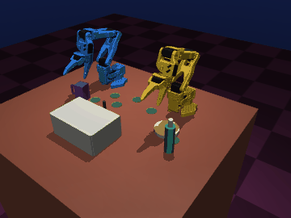

| Scripted skills, seeds 0–9 | Held-out seeds 10–19 | Learned plate + mug picks | OpenVINO INT8 vs PyTorch |
|:---:|:---:|:---:|:---:|
| **10 / 10** full task | **7 / 10** full task | **5 / 10** full task | **1.35 ms · 5.2× faster** |

</div>

---

### Highlights

- **The other arm really holds the mug while one arm pours** — the brief's own example. Arm B grips the mug by
  its handle and turns it out of the pourer's path; arm A tilts the bottle over it.
- **The learned policy completes whole tables.** With learned plate and mug picks (OpenVINO INT8 on the Intel iGPU),
  5 of 10 randomized seeds finish all 7 sub-goals.
- **The plan repairs itself.** The executor remembers goals it has achieved and re-plans when a later action undoes
  one (e.g. the drawer is bumped shut).
- **Fast on Intel.** INT8 policy inference in 1.35 ms on the CPU (5.2× PyTorch); the whole
  simulate → perceive → act loop runs faster than real time.
- **Honest scope.** Grasping uses a weld assist and pouring is judged geometrically — see
  [Limitations](#limitations-stated-openly).

## What it does

You give one sentence:

> *"Open the top drawer with arm A, pick up the plate with arm A and place it on the table, take the spoon with arm B
> and place it on the table, pick up the fork with arm B and hand it over to arm A, then place the fork, pick up the
> mug with arm B, pour water into the mug with arm A, then put the bottle back and place the mug on the table."*

The system turns it into a plan for the two arms and carries it out in a randomized MuJoCo scene. It checks every
step against what the cameras and simulator actually show, and repairs anything that goes wrong.

<table>
<tr>
<td align="center">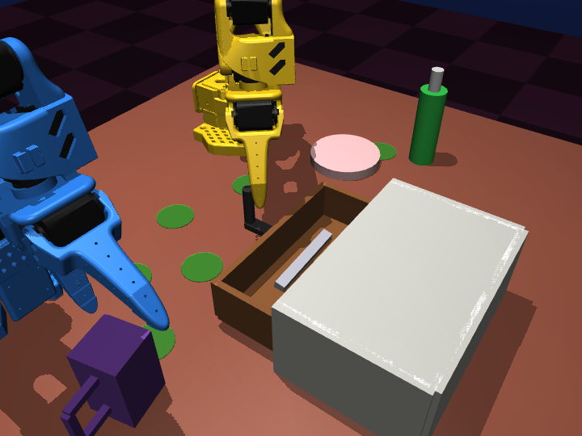<br/><b>1 · Open the drawer</b><br/><sub>arm A pulls the knob; cutlery is inside</sub></td>
<td align="center">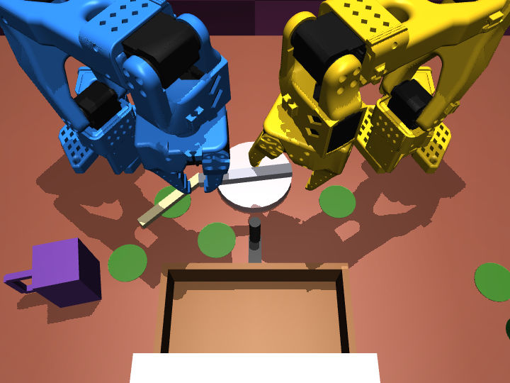<br/><b>2 · Hand-over</b><br/><sub>arm B passes the fork to arm A across the midline</sub></td>
<td align="center">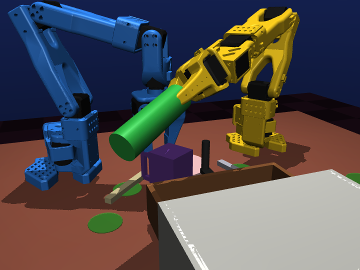<br/><b>3 · Two-arm pour</b><br/><sub>B holds the mug by its handle, A tilts the bottle</sub></td>
</tr>
<tr>
<td align="center">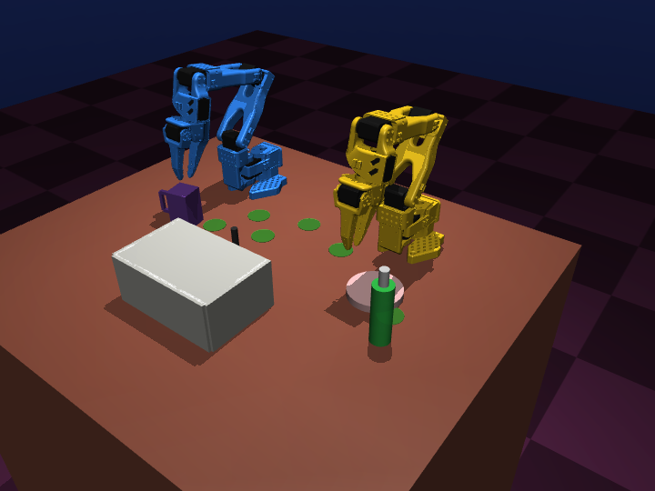<br/><b>Start</b></td>
<td align="center">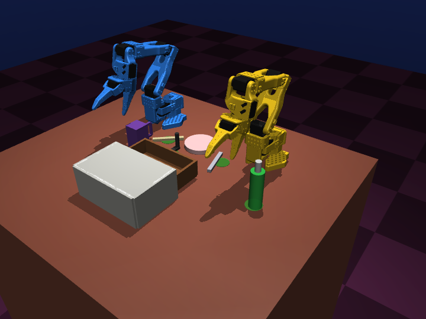<br/><b>Finished table</b></td>
<td align="center">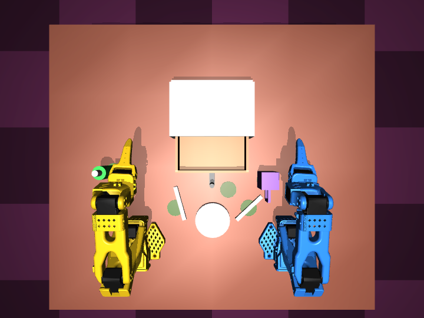<br/><b>Top view (policy camera)</b></td>
</tr>
</table>

## Results

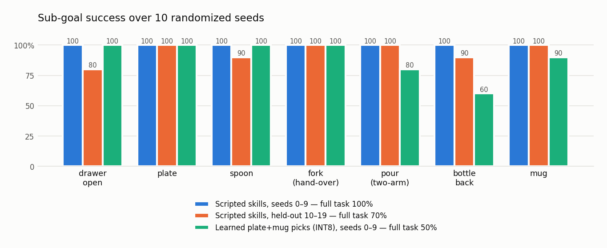

| Executor | Seeds | Full-task success | Notes |
|---|---|---|---|
| Scripted bimanual skills + closed-loop executor | 0–9 | **10 / 10 (100 %)** | seeds used during development |
| Scripted bimanual skills + closed-loop executor | 10–19 (held out) | **7 / 10 (70 %)** | every sub-goal ≥ 80 % |
| Learned ACT-Lite for **all** picks (INT8, Intel iGPU) + scripted rest | 0–9 | **2 / 10 (20 %)** | policy solved **86 %** of its 50 picks with no expert fallback |
| Learned ACT-Lite for **plate + mug** picks (default) | 0–9 | **5 / 10 (50 %)** | policy solved **80 %** of its 20 picks alone; drawer stays open in 10/10; bottle placed in 6/10 |

**What the learned-policy row tells us.** The policy picks objects reliably, but its approach paths are less precise
than the planner's. Near the drawer it often bumps the drawer shut, and around the bottle it knocks things over. The
executor detects and repairs some of this, but not all. So by default the policy handles picks in open space (plate,
mug), and the scripted skills handle picks in cluttered areas (cutlery in the drawer, the tall bottle).
With this split, full-task success rises from 20 % to 50 %; the remaining failures are mostly the bottle not being
put back upright after the pour.
`--policy-objects all` reproduces the all-picks row.

Sub-goals checked: drawer open · plate / spoon / fork / mug / bottle on target (mug and bottle upright) · poured.

### Robustness: every seed is a different scene

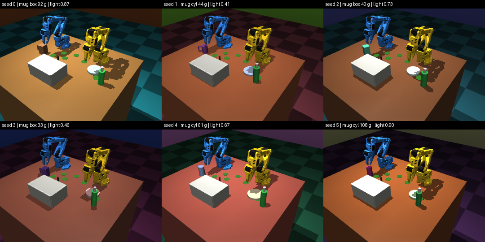

Randomized per seed: object positions, masses (mug 30–120 g, bottle 40–100 g, plate 50–150 g), table and object
friction, object size (±15 %), mug shape (cylinder / box), light intensity and position, sky / floor / table colours.

### Intel inference (OpenVINO 2026.3, i9-13900HX + Raptor Lake iGPU, Windows 11)

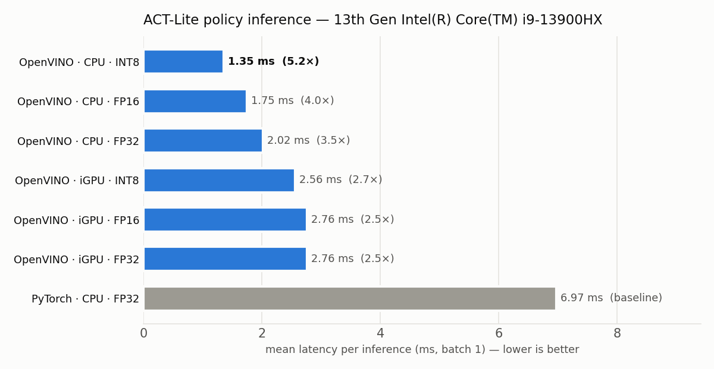

| Runtime | Device | Precision | Mean | p90 | Sync FPS | Throughput FPS | vs PyTorch |
|---|---|---|---|---|---|---|---|
| PyTorch | CPU | FP32 | 6.97 ms | 7.22 ms | 143.6 | – | 1.0× |
| OpenVINO | CPU | FP32 | 2.02 ms | 2.84 ms | 493.9 | 1789 | 3.4× |
| OpenVINO | CPU | FP16 | 1.75 ms | 1.85 ms | 571.2 | 1857 | 4.0× |
| OpenVINO | **CPU** | **INT8** | **1.35 ms** | **1.53 ms** | **742.8** | **3421** | **5.2×** |
| OpenVINO | iGPU | FP32 | 2.76 ms | 2.83 ms | 362.4 | 511 | 2.5× |
| OpenVINO | iGPU | FP16 | 2.76 ms | 2.91 ms | 362.3 | 513 | 2.5× |
| OpenVINO | iGPU | INT8 | 2.56 ms | 2.63 ms | 390.6 | 596 | 2.7× |

- Batch 1: two 96×128 camera images, joint state and instruction tokens in; a 20 × 12 action chunk out.
- **INT8 accuracy:** after NNCF quantization, outputs stay within 0.043 of PyTorch (FP16: 0.0004).
- **Closed loop:** the INT8 model on the iGPU averaged 6.6 ms per inference, well within the 250 ms re-planning
  period (20 Hz control, re-plan every 5 steps).
- **Real time:** one MuJoCo control step (25 physics sub-steps) takes 1.5 ms and rendering both cameras takes
  1.9 ms, so simulation, perception and policy together run well over 10× faster than real time.
- **Variance:** numbers above are from an idle, plugged-in run. Earlier runs on a busier laptop were 2–4× slower
  across the board (PyTorch 24.7 ms vs INT8 2.87 ms, 8.6×), with the same ranking: INT8 on CPU is always fastest.
- **No NPU numbers:** this laptop has no NPU. On a Core Ultra Series 2/3 machine, the same script benchmarks the
  NPU automatically.

### Learned policy training
- **Data:** 300 expert episodes (seeds 100–399, separate from the evaluation seeds), giving 117,383 frames of picks.
- **Training:** ACT-Lite (1.61 M parameters), 20 epochs on an RTX 4060 Laptop GPU, about 65 min.
- **Result:** best validation L1 was **0.0499** (normalized joint targets), reached at epoch 8.

## How it works

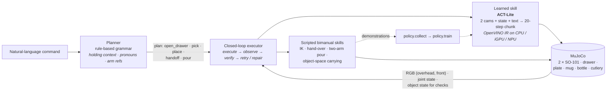

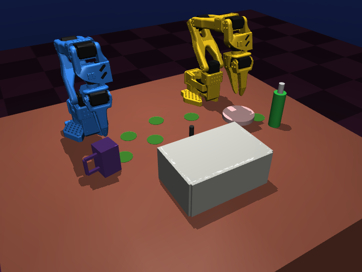

### Bimanual coordination
- **Hand-over (fork).** Arm B grips the fork by the end on its own side and brings it to a meeting point on the
  midline. Arm A turns its wrist to line up with the fork and grips the free end. A closes first, then B lets go,
  so the fork is never dropped.
- **Complementary action (pour).** Arm B slides the mug to the pouring spot and rotates it so the handle is out of
  arm A's path, then holds it steady. Arm A carries the bottle along a clear path and tilts it in stages (40° → 90°).
  IK solves directly for the spout position, and the bottle comes in high and from A's side so it never hits the mug.
- **Sharing the workspace.** Only one arm moves inside the shared area at a time. Tall objects are carried along
  raised, straight paths. A friction detent keeps the drawer open.

### Multi-modal reasoning
- **Planner memory across clauses.** The planner tracks what each arm is holding, so it understands "place **it**".
  It works out which arm gives and which receives in a hand-over, opens the drawer first if cutlery is requested,
  and puts down anything still held at the end.
- **Verification and repair.** After every step the executor checks the result against the actual scene and
  retries or re-grasps on failure. It also remembers goals it already achieved: if a later action undoes one
  (drawer bumped shut, object knocked away), it adds repair steps to the plan.
- **Policy inputs.** The learned policy uses both camera images, the joint state and the sub-instruction text.

### Robustness techniques
- Domain randomization on every seed.
- Checks after every step, with recovery.
- Placement corrected by forward kinematics, because a held object's offset rotates with the wrist.
- Wrist-roll search to choose reachable, collision-free put-down poses.
- IK kept on one elbow branch for consistent motion.

### ACT-Lite (learned policy)
- **Architecture:** ACT without the CVAE branch. A 4-stage conv backbone per camera produces image tokens, which are
  combined with a state token and instruction tokens. These go through a 3-layer transformer encoder and a 2-layer
  decoder with 20 action queries, which output 12-D joint targets for both arms.
- **Training:** L1 loss, AdamW with a OneCycle schedule, and brightness and state-noise augmentation.
- **Runtime:** temporal ensembling of overlapping action chunks. Only the commanded arm moves.

### OpenVINO pipeline
- **Conversion:** TorchScript trace, then `ov.convert_model`, then IR in FP32, FP16 (weight compression) and INT8
  (NNCF post-training quantization, transformer model type, 300 calibration frames). Export prints an accuracy check
  against PyTorch.
- **Benchmark:** mean / p50 / p90 / p99 latency, sync FPS, async throughput, compile time, and device name for every
  Intel device found.

| Workload | Intel target |
|---|---|
| MuJoCo physics + rendering | CPU P-cores (+ iGPU for OpenGL rendering) |
| ACT-Lite policy (20 Hz, re-plan every 5 steps) | iGPU (FP16 / INT8) or NPU (INT8); CPU fallback |
| Planner (rule-based) | CPU, < 1 ms per command |

## Repository

| Path | What |
|---|---|
| `sim/scene.py` | Procedural MjSpec scene and seeded domain randomization |
| `sim/env.py` | Environment: 20 Hz control, cameras, IK and tool-point IK, task checks |
| `planner/language.py` | Instruction → plan (rule grammar; an OpenVINO-GenAI LLM back-end stub with the same JSON schema is included but **not evaluated**) |
| `planner/skills.py` | Bimanual skills: pick, place, open_drawer, handoff, pour, carry |
| `planner/executor.py` | Closed-loop executor: checks, retries, goal repair, learned/scripted switching |
| `policy/` | ACT-Lite model, demo collection, training, runtime (PyTorch or OpenVINO) |
| `deploy/` | OpenVINO export (FP32 / FP16 / INT8) and Intel benchmark |
| `scripts/` | Episode runner, N-seed evaluation, annotated video writer, submission video, README media |
| `results/` | Evaluation tables (`*.md`), raw JSON, benchmark |
| `docs/images/` | Figures in this README (`python scripts/make_readme_media.py`) |

## Reproduce

```bash
pip install -r requirements.txt

# one annotated episode
python scripts/run_episode.py --seed 3 --video videos/seed3.mp4

# 10-seed evaluation with videos (scripted skills)
python scripts/evaluate.py --seeds 0-9 --videos videos --out results/eval_expert.json

# learned policy: data → train → export → benchmark → evaluate
python -m policy.collect --seeds 100-399 --skills pick --out data/demos --workers 6
python -m policy.train --data data/demos --out models/act_pick.pt --epochs 20 --workers 0
python -m deploy.export_openvino --ckpt models/act_pick.pt --data data/demos --out models
python -m deploy.benchmark --models models/act_pick_fp32.xml models/act_pick_fp16.xml models/act_pick_int8.xml \
       --torch models/act_pick.pt --sim --out results/benchmark.json
python scripts/evaluate.py --seeds 0-9 --policy models/act_pick_int8.xml --device GPU \
       --policy-objects plate,mug --out results/eval_policy_int8.json

# submission video and README figures
python scripts/make_submission_video.py --videos videos --eval results/eval_expert.json --out videos/submission.mp4
python scripts/make_readme_media.py --out docs/images
```

- **Platforms:** tested on Windows 11 (native OpenGL) and Linux (headless EGL, set automatically).
- **Windows training:** use `--workers 0`. Each DataLoader worker would otherwise load its own copy of the dataset
  into RAM.
- **Shortcut:** `run_all.sh` runs the whole pipeline.

## Limitations (stated openly)
- **Grasp assist.** When a gripper closes on the *intended* object within 3 cm, a weld constraint attaches it (and
  passes it between grippers during a hand-over). Pinch grasps with the SO-101 mesh jaws are unreliable in MuJoCo, so
  this keeps the evaluation focused on sequencing, coordination and perception. Arms, objects, drawer, table and the
  two arms still collide physically.
- **Pouring is geometric.** There is no fluid simulation. A pour counts when the bottle is tilted more than 55° with
  its spout above the mug rim for at least 0.8 s.
- **Learned vs scripted.** The learned policy covers the *pick* skill only. Place, hand-over, pour and drawer opening
  are scripted, and the two are reported separately above.
- **Language.** The planner is a rule-based grammar (tested on the default instruction and paraphrases in
  `planner/language.py`). An OpenVINO-GenAI LLM back-end with the same plan schema is stubbed in but was not
  evaluated for this submission.
- **Hardware.** Benchmarks ran on an i9-13900HX laptop, not a Core Ultra system, so there are no NPU numbers.
- **Next steps.** Replace the grasp assist with friction-only grasps, evaluate an INT4 LLM planner on OpenVINO GenAI,
  train place and hand-over skills, add a collision-aware loss or more demos near the drawer, evaluate on 30+ unseen
  seeds, and fine-tune SmolVLA / Pi0.5 on the same LeRobot-style data.

## Credits
SO-101 model: [TheRobotStudio/SO-ARM100](https://github.com/TheRobotStudio/SO-ARM100) (Apache-2.0) ·
[MuJoCo](https://mujoco.org) · [OpenVINO](https://github.com/openvinotoolkit/openvino) &
[NNCF](https://github.com/openvinotoolkit/nncf) · ACT — Zhao et al., *Learning Fine-Grained Bimanual Manipulation with
Low-Cost Hardware*, RSS 2023.
